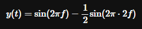
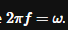

# Ejecución
```bash
antlr4 -Dlanguage=Python3 fourir.g4 -visitor -o dist 
```
```bash
python3 calculoFourier.py
```

La gramatica en ANTLR esta definida para recibir las variables necesarias para calcular la FFT de una función senoidal.

Para manejar números redondos, vamos a recrear una señal con un armónico de la frecuencia escogida y otro del doble de frecuencia:



donde:  

## Formato de entrada

En el archivo de texto entraran las variables para realizar el calculo, tales como 

(N = numero de intervalos) 

(freq = frecuencia en herzios) 

(dt = espaciado)

(FIN, indica el fin de ingreso de variables.)
```
n = 6
freq = 400hz
dt = 16
FIN
```