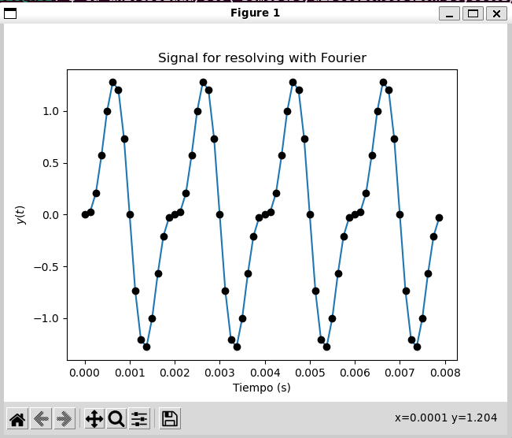
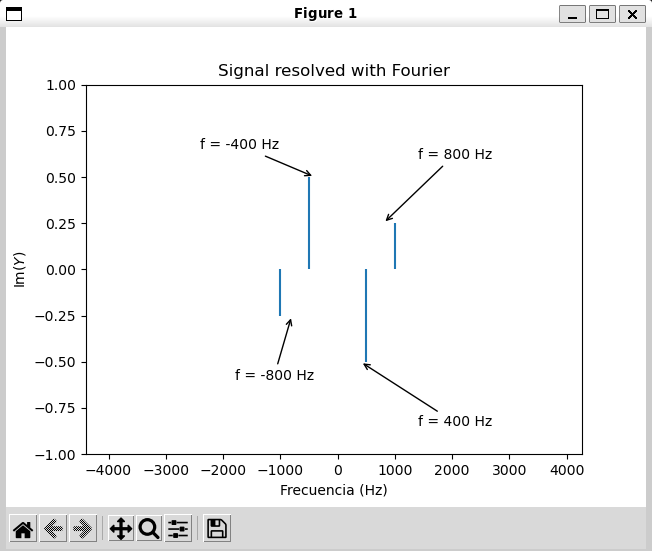

# FFT de una función senoidal sencilla

El alcance del programa es que, a partir de una gramatica definida en ANTLR, la cual nos permite tener entradas para las variables requeridas para realizar una tranformada rapida de Fourier a una función senoidal sencilla.

Para manejar números redondos, vamos a recrear una señal con un armónico de la frecuencia escogida y otro del doble de frecuencia:

$$ y(t)=\sin(2\pi f) - \frac{1}{2} \sin(2\pi\cdot2f) $$

donde $2\pi f = w$. Nótese que, por lo que hemos visto en el apartado anterior, veremos cuatro rayas en el espectro de esta función: dos para la frecuencia $f$ y otras dos para la $2f$. Vamos a imponer a priori el número de intervalos y la distancia entre ellos y de ahí vamos a calcular el intervalo de tiempo. Evidentemente así no se funciona cuando muestreamos un archivo de audio, pongo por caso, pero como digo así obtendremos el resultado exacto. 


### Señal por resolver con fourier 

Para este caso, la primera grafica que se genera hace referencia a la señal que vamos a transformar:


### Señal transformada con fourier

Luego, al cerrar la ventana emergente, aparecera la nueva grafica con la funcion transformada:




## Ejecución

### Formato de entrada

En el archivo de texto entraran las variables para realizar el calculo, tales como 

(N = numero de intervalos) 

(freq = frecuencia en herzios) 

(dt = espaciado)

(FIN, indica el fin de ingreso de variables.)

### Modificar *ejemplo.txt*

```
n = 6
freq = 400hz
dt = 16
FIN
```

### Generar parser, lexer y visitor desde la gramatica de ANTLR

```bash
antlr4 -Dlanguage=Python3 fourir.g4 -visitor -o dist 
```

### Ejecutar codigo de python

```bash
python3 calculoFourier.py
```